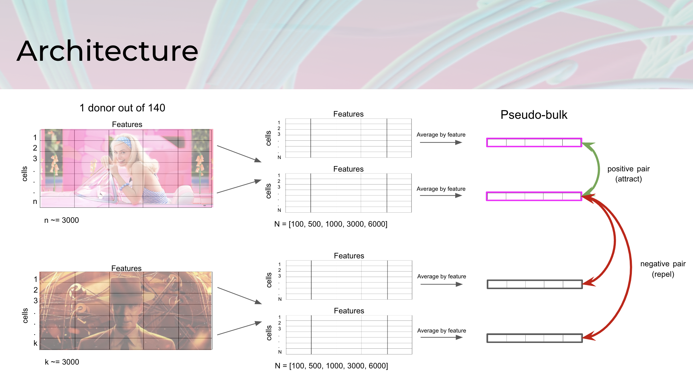
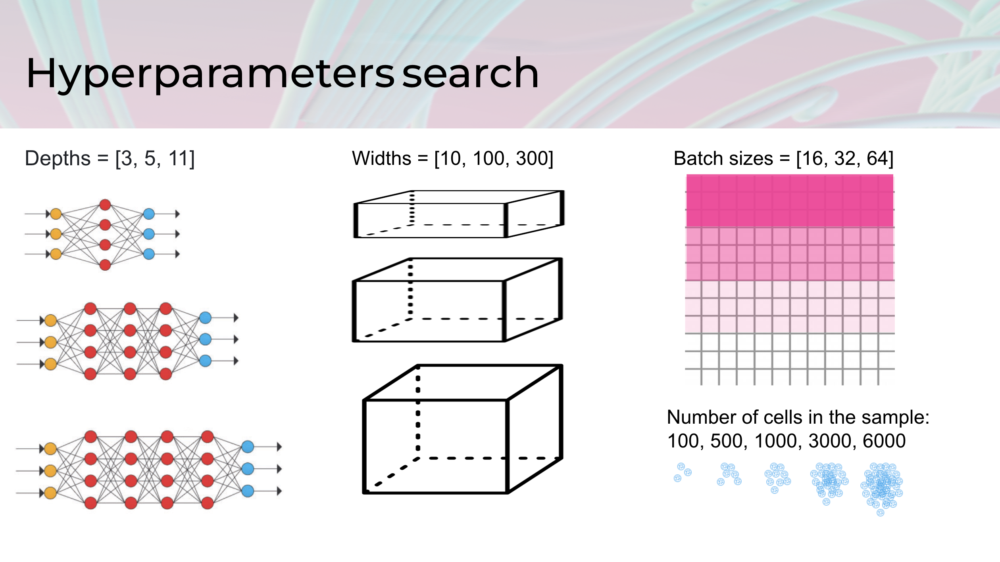
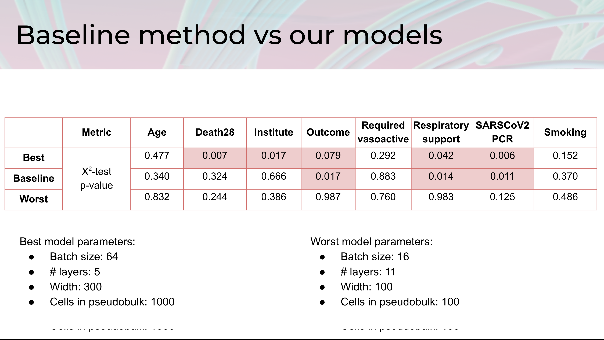

# Bioinformatics Hackathon'2023
## Contrastive learning for single-cell sample representation

### Team
- Vladimir Shitov (vladimir.shitov@helmholtz-munich.de)
- Liliia Bogdanova
- Amina Ibragimova
- Svetlana Tarbeeva

### Project description
Single-Cell RNA-sequencing data allows researchers to describe cell variability with unprecedented resolution. The number of single-cell datasets grows each year, leading to the emergence of atlassing projects, which combine data from hundreds or even thousands of individual donors. It opens the possibility to study the variability on a sample or patient level, discovering, for example, disease trajectories and linking them to molecular features. Several methods for sample representation exist. However, a contrastive learning approach was not yet applied to this task.

### Tasks
1. Apply the contrastive learning framework to represent samples from single-cell RNA sequencing data for COVID-19 datasets ✔️
2. Fine-tune the hyperparameters of the model, manually or using automated ML methods ✔️
3. Benchmark sample representation comparing it with baseline methods ✔️
4. Develop metrics for interpretation of representation ✔️
5. Check if the conclusions from the papers or other established facts can be supported by representation

### Task 1 – Contrastive learning for sample representation

We developed a neural-network model to learn distances between samples using a contrastive learning framework. The ideas were heavily inspired by SimCLR [1] and Unsupervised visualization of image datasets [2].

### Task 2 – hyperparameters search

We tested architectures with different depths and widths, and hyperparameters, such as the number of cells per sample and batch size.

We noted that models with smaller widths (3-5 hidden layers) better capture patient covariates. Networks with more than 11 hidden layers were not learning well.

### Task 3 – Baseline comparison

We compared sample-sample distances obtained from a learned representation with distances calculated from a total pseudobulk (per feature average) of each sample. 

### Task 4 – Interpretation of representation

We used the following approach to interpret learned representations
1. Calculation of the sample-sample distance matrix. This is not necessary for the following analysis but makes it easier to compare results to a different method. We used COVID-19 single-cell data from COMBAT consortium [3].
2. Clustering of samples using the leiden algorithm.
3. Statistical testing (using the Chi-square test), whether the biological variability (Outcome of the patients) and technical covariate (Institute, where samples were collected and prepared) differ between clusters. Note that the representation is obtained in purely unsupervised way, and the model doesn't know anything about outcome or other patients covariates. Thus, if there is a structure in the data, it is explained either by biology or by technical batch effects.
   

### Task 5 – Prior knowledge check

Not completed during the hackathon :(

## Conclusions

- Representation learning **captures biological variability** but is also affected by technical covariates
- Models with 3-5 neurons, batch size 64 and 1000 cells for sample representation **work the best**
- **Biological interpretation is complicated** because patients’ features are dependent on each other and technical covariates
- **Baseline model works very well**, more work is needed to beat it

# References 
1. Ting Chen, Simon Kornblith, Mohammad Norouzi, & Geoffrey Hinton. (2020). A Simple Framework for Contrastive Learning of Visual Representations.
2. Jan Niklas Böhm, Philipp Berens, & Dmitry Kobak. (2023). Unsupervised visualization of image datasets using contrastive learning.
3. COvid-19 Multi-omics Blood ATlas (COMBAT) Consortium. A blood atlas of COVID-19 defines hallmarks of disease severity and specificity. Cell, 185(5), 916–938.e58. https://doi.org/10.1016/j.cell.2022.01.012

